# 🚀 AWS Serverless Event-Driven ETL Pipeline

An end-to-end **serverless, event-driven ETL pipeline** built using AWS services.

The pipeline automatically processes CSV files uploaded to Amazon S3, triggers an AWS Lambda function, starts an AWS Glue ETL job, removes duplicate records using PySpark, stores the cleaned data back in Amazon S3, and sends an email notification using Amazon EventBridge and Amazon SNS when the ETL job completes successfully.

This project demonstrates how multiple AWS services can be integrated to build a scalable, automated, and event-driven data engineering workflow.

---

## 📌 Project Overview

The pipeline performs the following tasks automatically:

- Upload a CSV file to an Amazon S3 input folder.
- Amazon S3 generates an ObjectCreated event.
- AWS Lambda is triggered automatically.
- Lambda starts the AWS Glue ETL job using `boto3`.
- AWS Glue reads the CSV dataset from Amazon S3.
- PySpark removes duplicate records.
- `coalesce(1)` is used to reduce the output to a single partition.
- Cleaned data is stored in an Amazon S3 output folder.
- Amazon EventBridge detects successful Glue job completion.
- EventBridge forwards the event to an Amazon SNS topic.
- Amazon SNS sends an email notification to the subscribed user.
- Amazon CloudWatch stores Lambda execution logs for monitoring and debugging.

No manual intervention is required after uploading the dataset.

---

## 🏗️ Architecture

<p align="center">
  
</p>

### Pipeline Flow

```text
CSV File Upload
       ↓
Amazon S3 (older-data/)
       ↓
AWS Lambda
       ↓
boto3 start_job_run()
       ↓
AWS Glue ETL Job
       ↓
PySpark Data Processing
       ↓
Remove Duplicate Records
       ↓
Amazon S3 (new-data2/)
       ↓
Glue Job Status: SUCCEEDED
       ↓
Amazon EventBridge
       ↓
Amazon SNS
       ↓
Email Notification
```

---

## ⚙️ AWS Services Used

| AWS Service | Purpose |
|-------------|---------|
| Amazon S3 | Stores raw input and processed CSV files |
| AWS Lambda | Automatically starts the AWS Glue ETL job |
| AWS Glue | Performs ETL processing using PySpark |
| Amazon EventBridge | Detects successful AWS Glue job completion |
| Amazon SNS | Sends email notifications |
| Amazon CloudWatch | Stores Lambda execution logs |
| AWS IAM | Manages roles and permissions |
| boto3 | Programmatically starts the AWS Glue job |

---

## 🛠️ Technologies Used

- Python
- PySpark
- boto3
- Git
- GitHub

### AWS Services

- Amazon S3
- AWS Lambda
- AWS Glue
- Amazon EventBridge
- Amazon SNS
- Amazon CloudWatch
- AWS IAM

---

## 📂 Project Structure

```text
aws-event-driven-etl-pipeline/
│
├── lambda/
│   └── trigger_glue_job.py
│
├── glue/
│   └── employee_data_cleaning_job.py
│
├── sample-data/
│   └── employee_v3.csv
│
├── screenshots/
│   ├── 01-s3-input-folder.png
│   ├── 02-lambda-function-code.png
│   ├── 03-lambda-trigger-configuration.png
│   ├── 04-cloudwatch-lambda-logs.png
│   ├── 05-glue-visual-etl-workflow.png
│   ├── 06-glue-job-run-success.png
│   ├── 07-s3-output-folder.png
│   ├── 08-cleaned-output-csv.png
│   ├── 09-architecture.png
│   ├── 10-eventbridge-rule.png
│   ├── 11-sns-topic.png
│   └── 12-sns-email-notification.png
│
├── architecture.png
├── README.md
└── .gitignore
```

---

## 🔄 ETL Workflow

### 1. CSV Upload

A CSV file containing employee data is uploaded to the following Amazon S3 folder:

```text
s3://hitesh-event-driven-etl/older-data/
```

---

### 2. Amazon S3 Event Trigger

Amazon S3 detects the new CSV file using an ObjectCreated event.

The event automatically triggers the configured AWS Lambda function.

---

### 3. AWS Lambda Execution

The Lambda function receives the Amazon S3 event and starts the AWS Glue ETL job using the boto3 SDK.

```python
response = glue_client.start_job_run(
    JobName=GLUE_JOB_NAME
)
```

The Lambda function also records execution information in Amazon CloudWatch Logs.

---

### 4. AWS Glue ETL Processing

AWS Glue reads the CSV dataset from the S3 input folder.

The DynamicFrame is converted to a Spark DataFrame for data transformation.

```python
input_dataframe = input_dynamic_frame.toDF()
```

Duplicate records are removed using PySpark:

```python
cleaned_dataframe = input_dataframe.dropDuplicates()
```

The DataFrame is reduced to a single partition:

```python
single_file_dataframe = cleaned_dataframe.coalesce(1)
```

The processed DataFrame is then converted back to an AWS Glue DynamicFrame.

---

### 5. Store Cleaned Data

The cleaned dataset is written to:

```text
s3://hitesh-event-driven-etl/new-data2/
```

The output format is CSV.

---

### 6. Glue Job Completion Event

After the ETL job completes successfully, AWS Glue generates a job state change event.

Amazon EventBridge detects the following event:

```text
Glue Job State: SUCCEEDED
```

---

### 7. EventBridge Rule

The EventBridge rule monitors the AWS Glue job:

```text
employee-data-cleaning-job
```

The rule matches successful job completion events using the following event pattern:

```json
{
  "source": [
    "aws.glue"
  ],
  "detail-type": [
    "Glue Job State Change"
  ],
  "detail": {
    "jobName": [
      "employee-data-cleaning-job"
    ],
    "state": [
      "SUCCEEDED"
    ]
  }
}
```

---

### 8. Amazon SNS Email Notification

Amazon EventBridge forwards the successful Glue job event to the configured Amazon SNS topic.

The SNS topic sends an automatic email notification to the subscribed user.

This confirms that the complete ETL pipeline has executed successfully.

---

## 📊 Dataset Used

The project uses a sample employee CSV dataset containing duplicate records.

### Sample Input

```csv
employee_id,name,department,salary
101,Rahul,IT,50000
102,Priya,HR,45000
103,Amit,Finance,55000
101,Rahul,IT,50000
104,Neha,IT,60000
102,Priya,HR,45000
```

### Transformation

The AWS Glue ETL job performs the following operations:

```text
Read CSV
    ↓
Convert DynamicFrame to DataFrame
    ↓
Remove Duplicate Records
    ↓
Reduce Output Partitions
    ↓
Convert DataFrame to DynamicFrame
    ↓
Write Cleaned CSV to Amazon S3
```

### Sample Output

```csv
employee_id,name,department,salary
101,Rahul,IT,50000
102,Priya,HR,45000
103,Amit,Finance,55000
104,Neha,IT,60000
```

---

## ✨ Key Features

- Event-Driven Architecture
- Serverless Data Pipeline
- Automatic CSV Processing
- Amazon S3 Event Notifications
- AWS Lambda Automation
- boto3 Integration
- AWS Glue ETL
- PySpark Data Transformation
- Duplicate Record Removal
- Single-Partition Output
- Amazon EventBridge Integration
- Amazon SNS Email Notifications
- Amazon CloudWatch Logging
- AWS IAM Role-Based Permissions
- Automatic Pipeline Monitoring

---

## 📸 Project Screenshots

### 1. Amazon S3 Input Folder

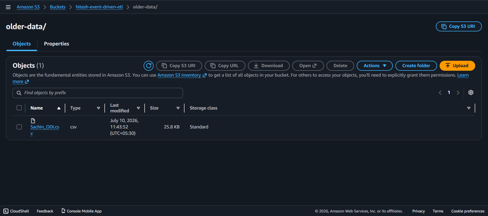

---

### 2. AWS Lambda Function Code

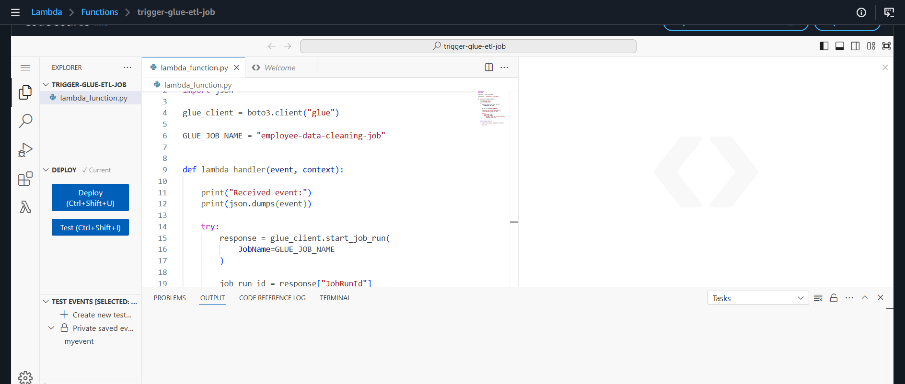

---

### 3. Amazon S3 Lambda Trigger

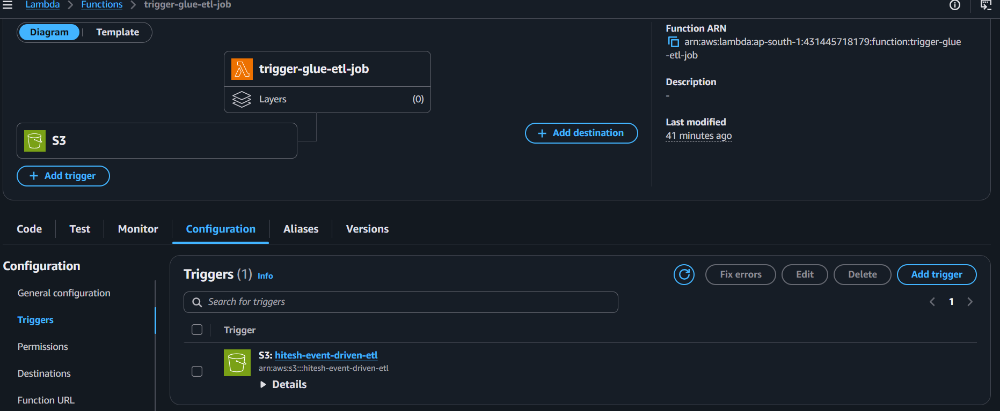

---

### 4. Amazon CloudWatch Logs

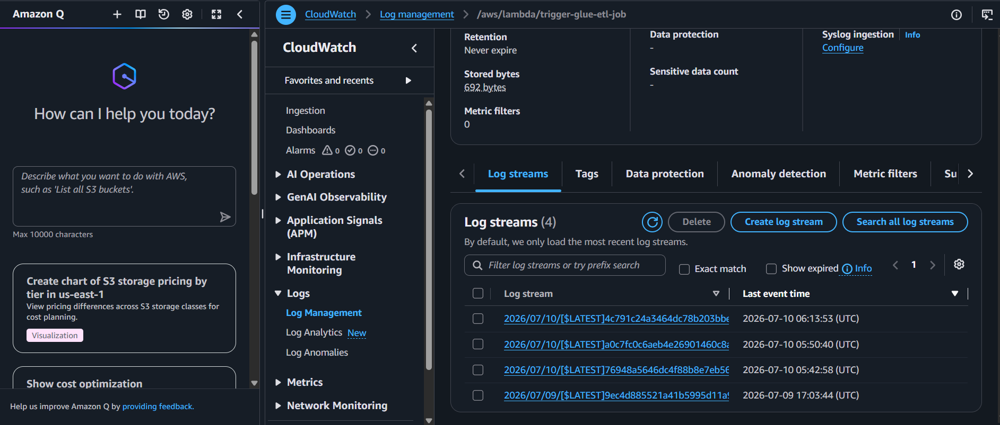

---

### 5. AWS Glue ETL Workflow

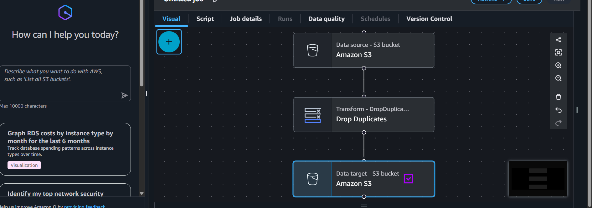

---

### 6. Successful AWS Glue Job Run

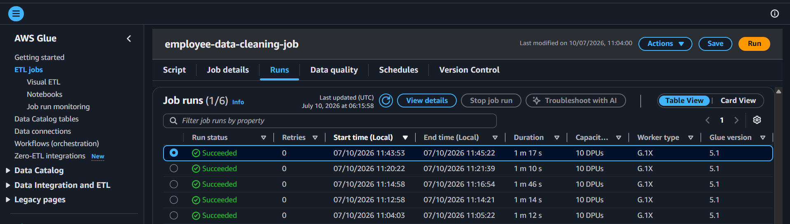

---

### 7. Amazon S3 Output Folder

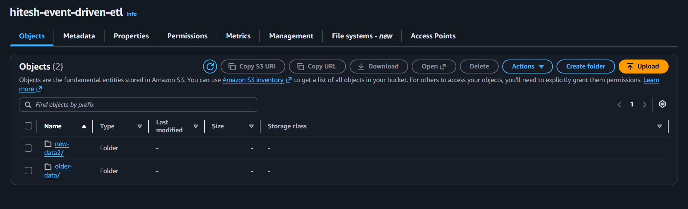

---

### 8. Cleaned CSV Output

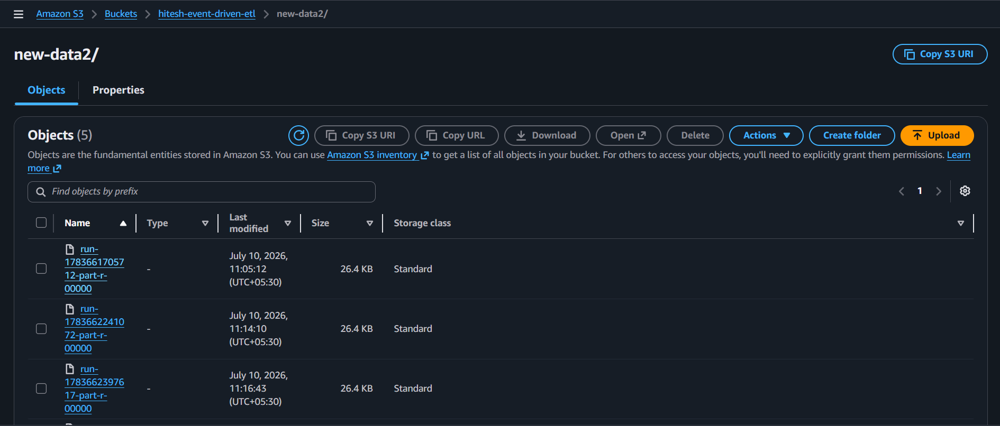

---

### 9. Project Architecture

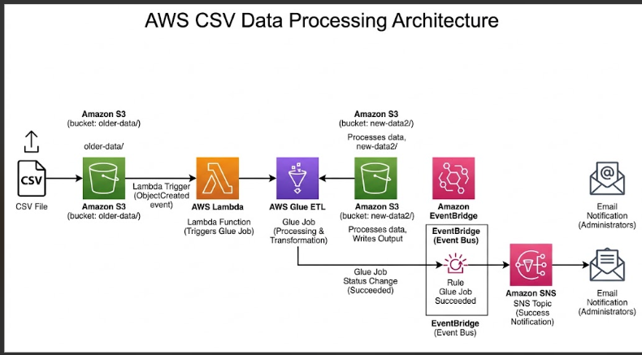

---

### 10. Amazon EventBridge Rule

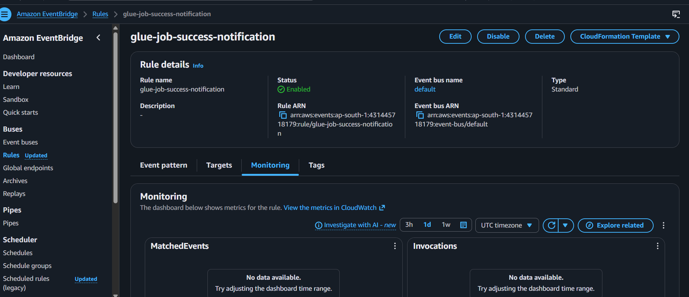

---

### 11. Amazon SNS Topic and Subscription

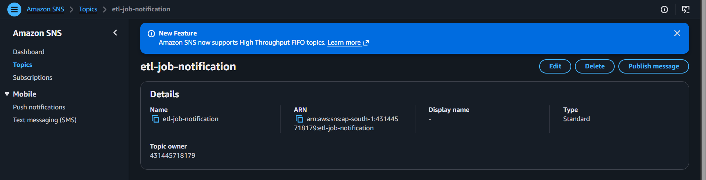

---

### 12. SNS Email Notification

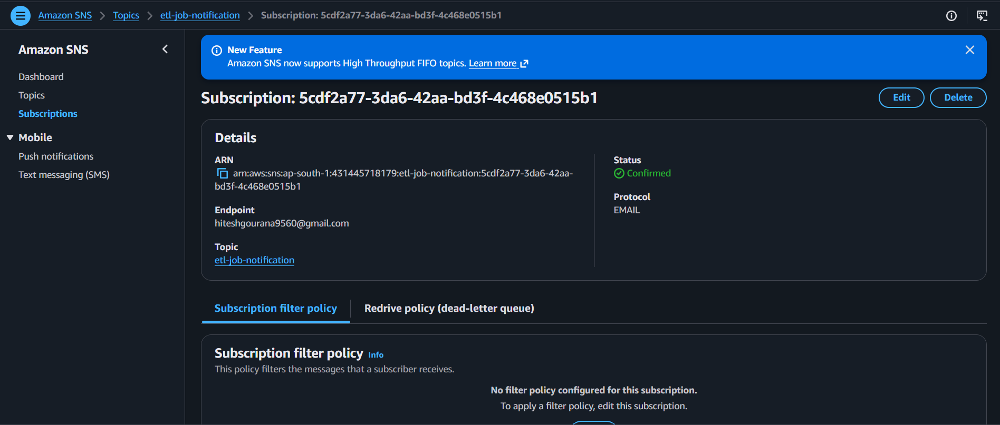

---

## 🔐 IAM Permissions

The project uses separate IAM roles for AWS Lambda and AWS Glue.

### AWS Lambda Permissions

The Lambda execution role requires permission to:

```text
glue:StartJobRun
```

### AWS Glue Permissions

The Glue IAM role requires permission to:

- Read files from the Amazon S3 input location.
- Write processed files to the Amazon S3 output location.
- Publish logs and monitoring information.

IAM permissions should follow the principle of least privilege in production environments.

---

## 🚀 How to Run the Project

1. Create an Amazon S3 bucket.
2. Create input and output folders in the S3 bucket.
3. Upload a sample CSV file to the input folder.
4. Create an AWS Glue ETL job.
5. Configure the Glue job to read the CSV dataset.
6. Remove duplicate records using PySpark.
7. Store the cleaned dataset in the S3 output folder.
8. Create an AWS Lambda function.
9. Give Lambda permission to start the Glue job.
10. Configure the S3 ObjectCreated event to trigger Lambda.
11. Create an Amazon SNS topic.
12. Create and confirm an email subscription.
13. Create an Amazon EventBridge rule.
14. Configure the EventBridge rule to detect successful Glue job completion.
15. Set the SNS topic as the EventBridge target.
16. Upload a new CSV file and test the complete pipeline.

---

## 🧪 Pipeline Testing

To test the complete project:

1. Upload a CSV file to the `older-data/` folder.
2. Verify that AWS Lambda is triggered.
3. Check Lambda execution logs in Amazon CloudWatch.
4. Verify that the AWS Glue job starts automatically.
5. Wait for the Glue job status to become `SUCCEEDED`.
6. Verify that the cleaned CSV is stored in `new-data2/`.
7. Verify that the EventBridge rule detects the Glue success event.
8. Check the subscribed email account for the SNS notification.

---

## 📚 Learning Outcomes

Through this project, I learned:

- How to design an event-driven data engineering pipeline.
- How to configure Amazon S3 Event Notifications.
- How to trigger AWS Lambda automatically.
- How to start AWS Glue jobs using boto3.
- How to build ETL workflows using AWS Glue.
- How to perform data transformations using PySpark.
- How to remove duplicate records from datasets.
- How to work with AWS Glue DynamicFrames and Spark DataFrames.
- How to configure IAM roles and permissions.
- How to monitor Lambda executions using CloudWatch.
- How to create Amazon EventBridge rules.
- How to integrate EventBridge with Amazon SNS.
- How to send automated email notifications.
- How multiple AWS services work together in a serverless architecture.

---

## 🚧 Future Enhancements

Future versions of this project can include:

- Pass the exact uploaded S3 object path from Lambda to AWS Glue.
- Process each uploaded CSV file independently.
- Add failed Glue job email notifications.
- Add a DynamoDB table for ETL job history.
- Add an API Gateway REST API.
- Build an interactive web dashboard.
- Upload CSV files directly from the dashboard.
- Download cleaned CSV files from the dashboard.
- Display processing statistics.
- Add data validation and error handling.
- Implement AWS Step Functions for advanced workflow orchestration.
- Add infrastructure as code using AWS CloudFormation or Terraform.
- Add CI/CD using GitHub Actions.

---

## 📈 Version History

### Version 1.0

- Amazon S3 integration
- AWS Lambda integration
- AWS Glue ETL
- Duplicate record removal
- Processed CSV output

### Version 2.0

- Amazon EventBridge integration
- Amazon SNS integration
- Automatic email notifications
- CloudWatch monitoring
- PySpark transformations
- Improved project documentation

### Version 3.0 — Planned

- Interactive Dashboard
- Job History Tracking
- DynamoDB Integration
- API Gateway Integration
- Failed Job Notifications
- Pipeline Analytics
- Real-Time Monitoring

---

## 👨‍💻 Author

**Hitesh Gourana**

B.Tech Computer Science and Engineering  
Arya College of Engineering, Jaipur

Interested in:

- Data Engineering
- Machine Learning
- Cloud Computing
- AWS
- MLOps

---

## ⭐ Support

If you found this project useful, consider giving the repository a ⭐.

It helps others discover the project and supports further development.